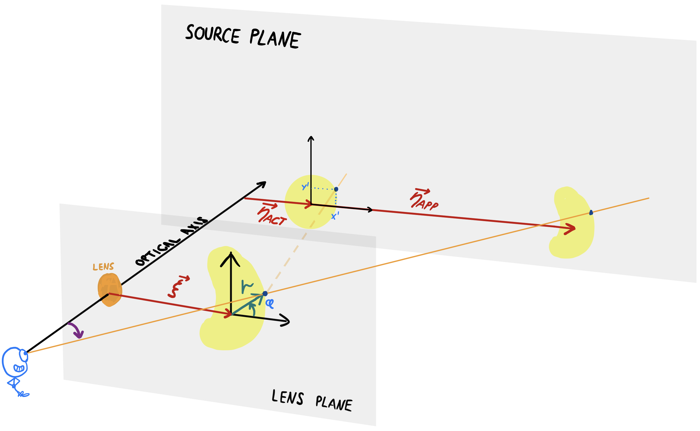
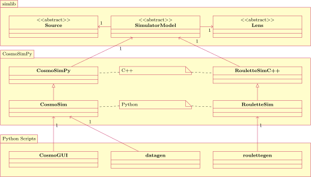

# CosmoSim

The purpose of CosmoSim is to simulate gravitation lenses.
In other words, giving a model of a lens and a model of a source,
it can generate the distorted image of the source as seen through
the lens.

## Architecture

The CosmoSim software suite consists of three layers.
1.  The simulator library, *simlib*
1.  The python wrapper, [CosmoSimPy](CosmoSimPy)
1.  A range of [executable python scripts](scripts/), including the GUI
   `CosmoGUI.py` and the batch generator `datagen.py`.

The mathematical model is implemented in the simulator library, which
is consequently the most important part to document properly.

## Python modules

All python code is collected in the `CosmoSimPy` directory

+ CosmoSim
    + Python package wrapping the simulator library.
+ Arguments.py
    + Argument parser and other shared functions for the scripts.
