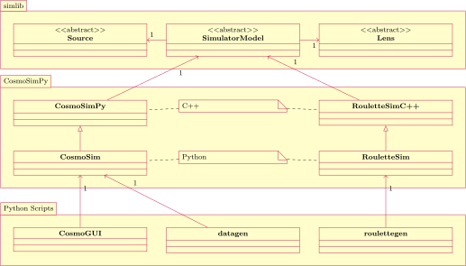

# CosmoSim Software Model

CosmoSim is written in C++ and Python.  
It has evolved over quite some time and there is some technical debt.
We will try to explain the architecure as 

## Architecture

The CosmoSim software suite consists of three layers.
1.  The [simulator library](model/Overview), *simlib*,
    implemented in C++
1.  The python wrapper, [CosmoSimPy](CosmoSimPy),
    implemented in C++ and python.
1.  The python module which several [scripts](scripts/Overview), 
    [GUI](scripts/GUI) and an API.

The mathematical model is implemented in the simulator library, which
is consequently the most important part to document properly.

## Python modules

Most of the code is packaged as a python module.
The only exception is the scripts to generate the formulæ for roulette
amplitudes (directory `python`).  

### Calculation of roulette amplitudes

For the SIS and SIE lenses, we have analytic formulas for the roulette
amplitudes.  The python scripts under the `python` directory compute
these formulas by symbolic algebra, and produce the files sie05.txt and
sis50.txt which are included in the distribution.

These formulas are imported by the C++ library (simlib) to compute
amplitudes during simulation.

## More information

+  and relationship between the software and the mathemaical model.
+ 
