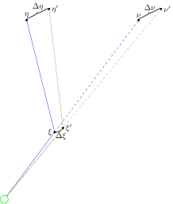
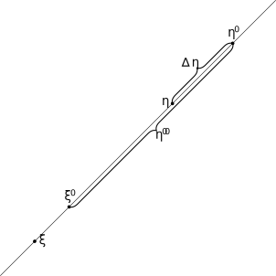

+ [Sketches of the Mathematical Model](Model)

# Terminology

+ `eta` ($\eta$) is the actual position of the source in the source plane.
    + This is set by `LensModel::setXY` or `LensModel::setPolar`
    + RaytraceModel uses a local $\eta$ corresponding to the pixel currently
      being evaluated, but this is local to that single method.
+ `nu` ($\nu$) is the apparent position of the source in the source plane.
    + This can be set with `LensModel::setNu`.
+ `xi` ($\xi$) is the apparent position of the image in the lens plane.
    + This is updated by `LensModel::setNu`, as $\xi=\chi\nu$.
    + RouletteModel also has a `setXi()` method to set $\xi$ to an arbitrary
      position.
+ `etaOffset` ($\Delta\eta$) is so that $\xi$ is the image
  $\eta+\Delta\eta$.

# Software Model

The software aims to separate the simulation model (LensModel)
and the actual lens (Lens), as is seen in the class diagram above.
This is only partly implemented so far.  The two simulation models
for point mass lenses as well as SphereModel integrate the lens 
in simulation model.  The SphereModel is a legacy class, kept
only for reference.  In practice it should be replaced with RouletteModel
using SIS.  The two point mass models, in contrast, will take some
work to decouple.

Only one actual lens model has been implemented, namely SIS.
However, it can be used either directly, or in a sampled version
by wrapping it inside SampledModel.  The sampled model is really
intended for lenses where an algebraic expression for the lens
potential $\psi$ is not known, but the only case implemented is
sampling an computable function.

## The Roulette Model

1. Masking methods
2. `setLens()`
3. `getDistortedPos(r,theta)`
4. The `distort()` function is inherited from LensModel.
    + It uses `etaOffset` + `getDistortedPos(r,theta)` to find the source pixel
5. `updateApparentAbs()`
    + uses $\eta$ as stored in the model object itself, and requests a $\xi$ to be
      calculated by the Lens object.
    + then it calls `setNu()` which is inherited from LensModel
    + this also sets `etaOffset = 0`
6. `setXi(xi1)`
    + set $\xi$ to the given value
    + calculate $\eta'$ corresponding to $\xi$ using raytrace
    + set $\Delta\eta=\eta'-\eta$

Special for resimulation from roulette amplitudes:

+ `setXiEta()` **to be implemented**

# Roulette Computation

The reference points are calculated in the following order

1. $\eta$ is the actual source position as given by the problem.
1. $\xi$ is the apparent position in the lens plane.
   This is calculated by inverting the ratrace equation.
2. $\nu=\xi/\chi$ is the apparent position in the source plane.
4. $\nu'$ is the centre of light in the distorted image.
   This is calculated from the output image, and it serves as
   an objective reference point which can be recalculated from the
   image regardless of shifts and cropping.
5. $\xi'=\chi\nu$ scales the centre point back to the lens plane.
5. $\eta'$ is the source point corresponding to $\xi'$ according
   to the raytrace equation.
   In principle, any simulator model can compute this, but raytrace
   is most efficient and there is no reason not to use this.

## Generate the Roulette Data Set

1.  Normal image generation
2.  Centre the image and record the image centre $\nu'$
3.  Find $\xi'=\chi\nu'$
4.  The the roulette amplitudes in $\xi'$ using `getAlpha` and `getBeta`
4.  get $\eta'$ and/or $\Delta\eta$
    - **TODO** how do we do this?
    + Set $\nu:=\nu'$ in the simulator?
5.  Write CSV
    - original data
    - $\Delta\eta$
    - amplitudes

## RouletteRegenerator: Simulation from Roulette Amplitudes 

1. $\xi := 0$ (centre of distorted image)
2. Consequently $\nu=0$
2. **TODO** Calculate $\eta'$ using the `setCentre()` method
2. $\eta := -\Delta\eta$ (source location, now relative to the distorted image)
4. Lens position is irrelevant and unknown, and can thus not be used as origin

This is somewhat different from the regular roulette simulation.
Both $\xi$ and $\eta$ are set explicitly and the lens location is unknown.
In theory the lens location could be inferred, but as a free variable it leaves
$\xi$ and $\eta$ to be set independently.

# TODO

+ When are the roulette amplitudes calculated?
+ `getDistortedPos(r,theta)` calculates the source plane position $\eta'$
  in the local co-ordinate system centred at `eta`, given a polar
  co-ordinates $(r,\theta)$ centred on `\xi` in the lens plane.
    + this is called in `LensModel::distort()`
    + `etaOffset` is added to the output to compensate if $\xi$ is not
      the apparent position
+ RaytraceModel has its own `distort()` function not using
  `getDistortedPos(r,theta)` working on a different logic

##  LensModel flowchart
