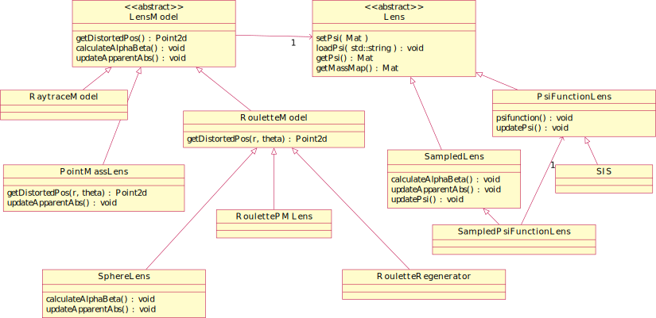

+ [Sketches of the Mathematical Model](Model)
+ [Raytrace Simulation](Raytrace) 
+ [Roulette Model](Roulette)

# Software Model

At the highest level, the simulator consists of three components.
1.  [lens model](Lens) (Lens) which implements a mathematical description
    of the lens.
2.  [source model](Source) (Source) which gives the mathematical description
    of the source and produce undistorted images of it.
3.  simulation model (LensModel) which calculates distorted images
    by using the lens and source models.
    Some simulation models are couples the lens model for various reasons. 

## Modelling the Lens 

The software aims to separate the simulation model (LensModel)
and the actual lens (Lens), as is seen in the class diagram above.
This is only partly implemented so far.
The two simulation models for point mass lenses integrate the lens 
in simulation model.
Decoupling them appears to be non-trivial.

Only one actual lens model has been fully implemented, namely SIS.
The SIE model works in the Raytrace model but not yet in the Roulette
model.
These models can be used either directly, or in a sampled version
by wrapping it inside SampledModel.  The sampled model is really
intended for lenses where an algebraic expression for the lens
potential $\psi$ is not known, but the only case implemented is
sampling an computable function.

## The Lens Model

Critical functions
+ `eta` is the actual source position, and is returned by `getEta()`
+ `updateApparentAbs)` does several things
    + It samples $\psi$, calling `lens->updatePsi(im.size())`
    + It sets the apparent position $\nu$, by first geting $\xi$
      from the lens by calling `getXi($\chi\eta$)`.

# Terminology

+ `eta` ($\eta$) is the actual position of the source in the source plane.
    + This is set by `LensModel::setXY` or `LensModel::setPolar`
    + RaytraceModel uses a local $\eta$ corresponding to the pixel currently
      being evaluated, but this is local to that single method.
+ `nu` ($\nu$) is the apparent position of the source in the source plane.
    + This can be set with `LensModel::setNu`.
+ `xi` ($\xi$) is the apparent position of the image in the lens plane.
    + This is updated by `LensModel::setNu`, as $\xi=\chi\nu$.
    + RouletteModel also has a `setXi()` method to set $\xi$ to an arbitrary
      position.
+ `etaOffset` ($\Delta\eta$) is so that $\xi$ is the image
  $\eta+\Delta\eta$.

# TODO

+ `getDistortedPos(r,theta)` calculates the source plane position $\eta'$
  in the local co-ordinate system centred at `eta`, given a polar
  co-ordinates $(r,\theta)$ centred on `\xi` in the lens plane.
    + this is called in `LensModel::distort()`
    + `etaOffset` is added to the output to compensate if $\xi$ is not
      the apparent position
+ RaytraceModel has its own `distort()` function not using
  `getDistortedPos(r,theta)` working on a different logic

##  LensModel flowchart

# Technical Design

## Components

### C++ components

+ Simulation Models
    + `LensModel.cpp` is the abstract base class.
    + Modular Lens Models
        + `RouletteModel.cpp`
        + `Raytrace.cpp`
    + Semi-Modular Models using `RotatedModel.cpp` as a superclass.
      It overrides functions to rotate the image and make all calculations
      assuming the source placed on the $x$-axis.
      The subclasses override `getDistortedPos()` to hardcode the actual
      distortion, and thus assume a specific lens model, but they still
      delegate `getXi()` to a Lens Object.
        + `PointMassExact.cpp` simulates the point mass model
          using the exact formulation
        + `PointMassRoulette.cpp` simulates the point mass model using
          the Roulette formalism
    + Monolithic Lens Models
	+ `RouletteRegenerator.cpp` is for simulation from roulette amplitudes
	   without any concrete lens model.
+ Lens Models
    + `SIS.cpp` 
    + `SIE.cpp`  (not tested)
    + `PointMass.cpp` is incomplete and so far used only with the `RotateModel` models. 
+ Source Models
    + `Source.cpp` is the abstract base class.
    + `SphericalSource.cpp` is standard Guassian model
    + `EllipsoidSource.cpp` is an ellipsoid Guassian model
    + `TriangleSource.cpp` is a three colour triangle source,
       intended for debugging
+ `simaux.cpp` is auxiliary functions
+ `CosmoSim.cpp` defines the `CosmoSimPy` class with python bindigs.
  This class operates as a facade to the library, and does not 
  expose the individual classes.

### Python Components

+ `CosmoSim` is a wrapper around `CosmoSimPy` from `CosmoSim.cpp`,
  defining the `CosmoSim` class.
+ `CosmoGUI` is a tkinter desktop application, providing a GUI to the
  simulator
+ `CosmoSim.View` is a tkinter widget displaying the source and 
  distorted image for `CosmoGUI`.
+ `CosmoSim.Controller` is a tkinter widget to interactively set
  the simulator parameters for `CosmoGUI`.
+ `CosmoSim.Image` provides post-processing functions for the images.
+ `datagen.py` is a batch script to generate distorted images.

## Lens Model Class

### Virtual Functions

The following virtual functions have to be overridden by most subclasses.
They are called from the main update function and overriding them, the entire
lens model changes.

+ `calculateAlphaBeta()`
  pre-calculates $\alpha$ and $\beta$ in the distortion equation.
+ `getDistortedPos()`
  calculates the distortion equation for a give pixel.

The constructor typically has to be overridden as well, to load the formulæ for
$\alpha$ and $\beta$.

### Setters 

Setters are provided for all of the control parameters.

+ `updateXY` to update the $(x,y)$ co-ordinates of the actual image, the
  relative distance $\chi$ to the lens compared to the source, and the
  Einstein radius $R_E$.
  This has to update the apparent position which depends on all of these
  variables.
+ `updateSize` to update the size or standard deviation of the source.
+ `updateNterms` to update the number of terms in the sum after truncation
+ `updateAll` to update all of the above

### Getters

Getters are provided for the three images.

+ `getActual()`
+ `getApparent()`
+ `getDistorted()`

### Update

The main routine of the `Simulator` is `update()` which recalculates the 
three images: actual, apparent, and distorted.  This is called by the setters.

In addition to the virtual functions mentioned above, it depends on

+ `parallelDistort()` and `distort()` which runs the main steps in parallel.
+ `drawParallel()` and `drawSource()` which draws the source image.

## Auxiliaries 

The `simaux.cpp` file provides the following:

+ `factorial_()`
+ `refLines()` to draw the axis cross

