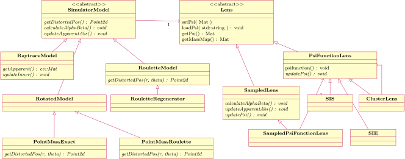

+ [Sketches of the Mathematical Model](Model)
+ [Raytrace Simulation](Raytrace) 
+ [Roulette Model](Roulette)

# Simulator Library

At the highest level, the simulator consists of three components.
1.  [lens model](Lens) (Lens) which implements a mathematical description
    of the lens.
2.  [source model](Source) (Source) which gives the mathematical description
    of the source and produce undistorted images of it.
3.  [simulation model](Simulator) (SimulatorModel) which calculates distorted images
    by using the lens and source models.
    Some simulation models are couples the lens model for various reasons. 

## Modelling the Lens 

The software aims to separate the simulation model (LensModel)
and the actual lens (Lens), as is seen in the class diagram above.
This is only partly implemented so far.
The two simulation models for point mass lenses integrate the lens 
in simulation model.
Decoupling them appears to be non-trivial.

Only one actual lens model has been fully implemented, namely SIS.
The SIE model works in the Raytrace model but not yet in the Roulette
model.
These models can be used either directly, or in a sampled version
by wrapping it inside SampledModel.  The sampled model is really
intended for lenses where an algebraic expression for the lens
potential $\psi$ is not known, but the only case implemented is
sampling an computable function.

## Auxiliaries 

The `simaux.cpp` file provides the following:

+ `factorial_()`
+ `refLines()` to draw the axis cross

