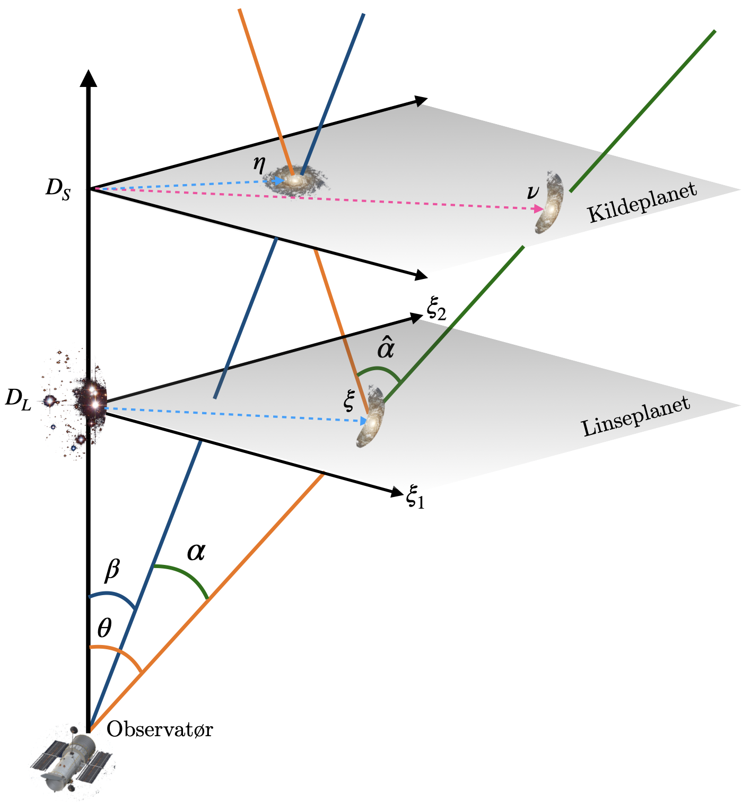

# Lens Potential and Basic Notation

**Under construction**

We assume a flat sky, so that the source is contained in a plane $S$
at distance $D_S$ from the observer, and the lens in a plane $L$ at
distance $D_L$ from the observer.
The optical axis is the line from the observer through the lens.
The planes $S$ and $L$ are orthogonal on the optical axis, and have
origin in the intersection therewith.

We consider a single source point at $\boldsymbol{\eta}_S$ in $S$.
The apparent position, as seen by the observer, is at $\nu_S$ and
\begin{equation}
  \Delta\boldsymbol{\eta}_S = \boldsymbol{\nu}_S - \boldsymbol{\eta}_S
\end{equation}

The deflection is most easily described in terms of angles, so 
we define $\beta$ and $\theta$ as the angles between 
the optical axis and respectivel
$\boldsymbol{\eta}_S$ and  $\boldsymbol{\nu}_S$.
We defined $\alpha=\theta-\beta$ as the angle between
$\boldsymbol{\eta}_S$ and  $\boldsymbol{\nu}_S$.

The convergence, or dimensionless projected surface-mass density, is given
as a function $\kappa$, which is related to $\psi$ as follows:
\begin{equation}
  \kappa(X,Y)= \frac12D_L^2\left(\psi_{xx}(X,Y) + \psi_{yy}(X,Y)\right)
\end{equation}

