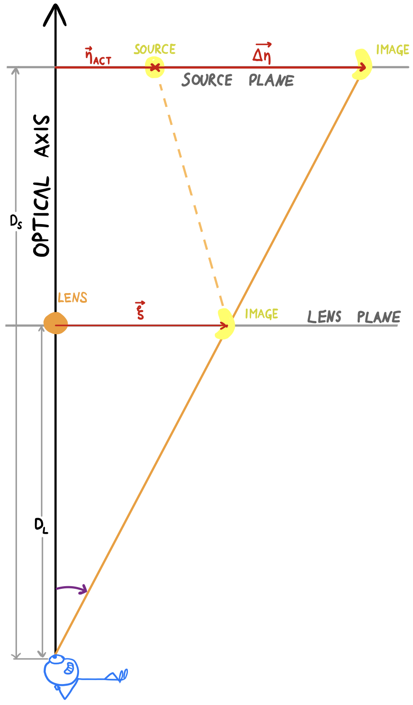

# The Roulette Formalæ

**DRAFT under construction**

\begin{equation}
\alpha\_s^m = - \frac{1}{2^{\delta\_{0s}}} D\_\textrm{L}^{m+1}
\sum\_{k=0}^m\binom{m}{k}
  \left(\mathcal{C}\_s^{m(k)}\partial\_{\xi\_1}+\mathcal{C}\_s^{m(k+1)}\partial\_{\xi\_2}\right)
\partial\_{\xi\_1}^{m-k}\partial\_{\xi\_2}^k\psi
\end{equation}

\begin{equation}
   \mathcal{C}\_s^{m(k)}=\frac{1}{\pi}\int\_{-\pi}^{\pi}{\rm d}\phi\sin^k\phi\cos^{m-k+1}\phi\cos s\phi
\end{equation}

\begin{equation}
   \beta\_s^m=-D\_\textrm{L}^{m+1}\sum\_{k=0}^m\binom{m}{k}\left({\mathcal{S}}\_s^{m(k)}\partial\_{\xi\_1}+{\mathcal{S}}\_s^{m(k+1)}\partial\_{\xi\_2}\right)\partial\_{\xi\_1}^{m-k}\partial\_{\xi\_2}^k\psi
\end{equation}

\begin{equation}
   \mathcal{S}\_s^{m(k)}=\frac{1}{\pi}\int\_{-\pi}^{\pi}{\rm d}\phi\sin^k\phi\cos^{m-k+1}\phi\sin s\phi.
\end{equation}

The observed lensing is decomposed into two steps, as shown the figure.
The first step is a translation (deflection), corresponding to the difference 
$\boldsymbol{\Delta\eta}$ between actual 
($\boldsymbol{\eta}\_\textrm{act}$)
and apparent 
($\boldsymbol{\eta}\_\textrm{app}$) source-plane position.
In the roulette formalism, this translational part of the lensing is given as
\begin{equation}
   \boldsymbol{\Delta\eta}
   =\boldsymbol{\eta}\_\textrm{app}-\boldsymbol{\eta}\_\textrm{act}
   =-D\_\textrm{S}\cdot(\alpha^0\_1,\beta^0\_1),
\end{equation}
where $(\alpha^0_1,\beta^0_1)$ is a vector of roulette amplitudes, as
defined above.

The second step is the actual, non-linear distortion.
The distorted image is drawn in a local co-ordinate system in the lens
plane, centred at $\boldsymbol{\xi}=(\xi_1,\xi_2)$, which corresponds to 
$\boldsymbol{\eta}\_\textrm{app}$ in the source plane.
We write $\xi=|\boldsymbol{\xi}|$ for the distance between the distorted
image and the lens in the lens plane.
Since $\boldsymbol{\xi}$ and $\boldsymbol{\eta}\_{\mathrm{app}}$ lie on the same
line through the viewpoint (cf. figure), we have
\begin{equation}
  \xi = |\boldsymbol{\xi}| = \frac{D\_\textrm{L}}{D\_\textrm{S}}\cdot|\boldsymbol{\eta}\_{\mathrm{app}}|.
\end{equation}
Following Clarkson, we use polar co-ordinates $(r,\phi)$ for the
distorted image.
The source image is described in Cartesian co-ordinates $(x^\prime,y^\prime)$ centered
at $\boldsymbol{\eta}\_\textrm{act}$ in the source plane.
Thus the light observed at a position (pixel) $(r,\phi)$ is drawn from
a different position (pixel) $(x',y')=\mathcal{D}$$(r,\phi)$ in the source image.
From~Eq.~48 in \citet{Clarkson_2016_II} it is possible to show that 
the mapping $\mathcal{D}$ is given as
\begin{aligned}
      \frac{D\_{\mathrm{L}}}{D\_{\mathrm{S}}}\cdot
   \begin{bmatrix} x' \\\\ y' \end{bmatrix} &=
   r\cdot\begin{bmatrix} \cos\phi \\\\ \sin\phi \end{bmatrix} 
      + \sum\_{m=1}^{\infty} \frac{r^m}{m!\cdot D\_{\mathrm{L}}^{m-1}}
      \cdot\sum\_{s=0}^{m+1} c\_{m+s}
       \left(\alpha\_s^m \boldsymbol{A}\_{s} + \beta\_s^m \boldsymbol{B}\_{s} \right) 
       \begin{bmatrix} C^+ \\\\ C^- \end{bmatrix}
   \\\\\\\\
   C^\pm &= \pm \frac{s}{m+1},\\\\\\\\
   c\_{m+s} &= 
      \frac{1 - (-1)^{m+s}}{4} =
   \begin{cases}
      0, \quad m+s \text{ is even},\\\\\\\\
      \frac12, \quad m+s \text{ is odd},
   \end{cases}
\\\\\\\\
    \boldsymbol{A}\_{s} &= \begin{bmatrix}
    \cos{(s-1)\phi} & \cos{(s+1)\phi} \\\\\\\\
    -\sin{(s-1)\phi} &  \sin{(s+1)\phi} \end{bmatrix},
    \\\\\\\\
    \boldsymbol{B}\_{s} &=
    \begin{bmatrix} 
        \sin{(s-1)\phi} & \sin{(s+1)\phi} \\\\\\\\
        \cos{(s-1)\phi} & -\cos{(s+1)\phi} 
    \end{bmatrix}.
\end{aligned}
The coefficients $\alpha\_m^s$ and $\beta\_m^s$ depend on the lens potential
$\psi(\xi_1,\xi_2)$, from which one may derive the physical properties of the lens.

In practice the sum has to be truncated by limiting $m\le m_0$ for some $m_0$.

