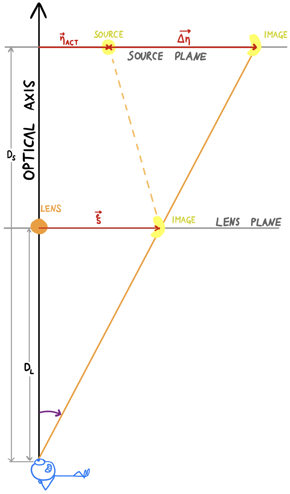

# The Roulette Formalism

**DRAFT under construction**

**TODO** 
The formalism should be rewritten to use angular distances.
In the implementation, the primary unit is pixels in the source plane.
However, $\psi$ is a function of $\boldsymbol{\xi}$ in the lens plane,
still measured by the same linear unit.
It would be convenient if we could avoid the scaling
and still get consistent nomenclature.

Using angular coordinates, such that 
$$
\partial_i=\frac{\partial}{\partial\theta_i}
$$ 
we find the following expressions for the so-called Roulette amplitudes.

$$
\begin{equation}
\alpha_s^m = - \frac{1}{2^{\delta_{0s}}}
\sum_{k=0}^m\binom{m}{k}
  \left(\mathcal{C}_s^{m(k)}\partial_1+\mathcal{C}_s^{m(k+1)}\partial_2\right)
\partial_1^{m-k}\partial_2^k\psi
\end{equation}
$$

$$
\begin{equation}
   \mathcal{C}_s^{m(k)}=\frac{1}{\pi}\int_{-\pi}^{\pi}{\rm d}\phi\sin^k\phi\cos^{m-k+1}\phi\cos s\phi
\end{equation}
$$

$$
\begin{equation}
   \beta_s^m=-\sum_{k=0}^m\binom{m}{k}\left({\mathcal{S}}_s^{m(k)}\partial_1+{\mathcal{S}}_s^{m(k+1)}\partial_2\right)\partial_1^{m-k}\partial_2^k\psi
\end{equation}
$$

$$
\begin{equation}
   \mathcal{S}_s^{m(k)}=\frac{1}{\pi}\int_{-\pi}^{\pi}{\rm d}\phi\sin^k\phi\cos^{m-k+1}\phi\sin s\phi.
\end{equation}
$$

The observed lensing is decomposed into two steps, as shown the figure.
The first step is a translation (deflection), corresponding to the difference 
$\boldsymbol{\Delta\eta}$ between actual 
($\boldsymbol{\eta}_\textrm{act}$)
and apparent 
($\boldsymbol{\eta}_\textrm{app}$) source-plane position.
In the roulette formalism, this translational part of the lensing is given as
\begin{equation}
   \boldsymbol{\Delta\eta}
   =\boldsymbol{\eta}_\textrm{app}-\boldsymbol{\eta}_\textrm{act}
   =-D_\textrm{S}\cdot(\alpha^0_1,\beta^0_1),
\end{equation}
where $(\alpha_1^0,\beta_1^0)$ is a vector of roulette amplitudes, as
defined above.

The second step is the actual, non-linear distortion.
The distorted image is drawn in a local co-ordinate system in the lens
plane, centred at $\boldsymbol{\xi}=(\xi_1,\xi_2)$, which corresponds to 
$\boldsymbol{\eta}_\textrm{app}$ in the source plane.
We write $\xi=|\boldsymbol{\xi}|$ for the distance between the distorted
image and the lens in the lens plane.
Since $\boldsymbol{\xi}$ and $\boldsymbol{\eta}_{\mathrm{app}}$ lie on the same
line through the viewpoint (cf. figure), we have
$$
  \xi = |\boldsymbol{\xi}| = \frac{D_\textrm{L}}{D_\textrm{S}}\cdot|\boldsymbol{\eta}_{\mathrm{app}}|.
$$
Following Clarkson, we use polar co-ordinates $(r,\phi)$ for the
distorted image.
The source image is described in Cartesian co-ordinates $(x^\prime,y^\prime)$ centered
at $\boldsymbol{\eta}_\textrm{act}$ in the source plane.
Thus the light observed at a position (pixel) $(r,\phi)$ is drawn from
a different position (pixel) $(x',y')=\mathcal{D}$$(r,\phi)$ in the source image.
From Eq. (48) in 
it is possible to show that the mapping $\mathcal{D}$ is given as

$$
\begin{aligned}
   \begin{bmatrix} \beta_1 \\\\ \beta_2 \end{bmatrix} &=
   \theta\cdot\begin{bmatrix} \cos\phi \\\\ \sin\phi \end{bmatrix} 
      + \sum_{m=1}^{\infty} \frac{\theta^m}{m!}
      \cdot\sum_{s=0}^{m+1} c_{m+s}
       \left(\alpha_s^m \boldsymbol{A}_{s} + \beta_s^m \boldsymbol{B}_{s} \right) 
       \begin{bmatrix} C^+ \\\\ C^- \end{bmatrix}
   \\
   C^\pm &= \pm \frac{s}{m+1},
   \\
   c_{m+s} &= 
      \frac{1 - (-1)^{m+s}}{4} =
   \begin{cases}
      0, \quad m+s \text{ is even},\\
      \frac12, \quad m+s \text{ is odd},
   \end{cases}
\\
    \boldsymbol{A}_{s} &= \begin{bmatrix}
    \cos{(s-1)\phi} & \cos{(s+1)\phi} \\
    -\sin{(s-1)\phi} &  \sin{(s+1)\phi} \end{bmatrix},
    \\
    \boldsymbol{B}_{s} &=
    \begin{bmatrix} 
        \sin{(s-1)\phi} & \sin{(s+1)\phi} \\
        \cos{(s-1)\phi} & -\cos{(s+1)\phi} 
    \end{bmatrix}.
\end{aligned}
$$
The coefficients $\alpha_m^s$ and $\beta_m^s$ depend on the lens potential
$\psi(\theta_1,\theta_2)$, from which one may derive the physical properties of the lens.

In practice the sum has to be truncated by limiting $m\le m_0$ for some $m_0$.

The roulette amplitudes are always calculated in a specific 
[Reference Point](ReferencePoint).
