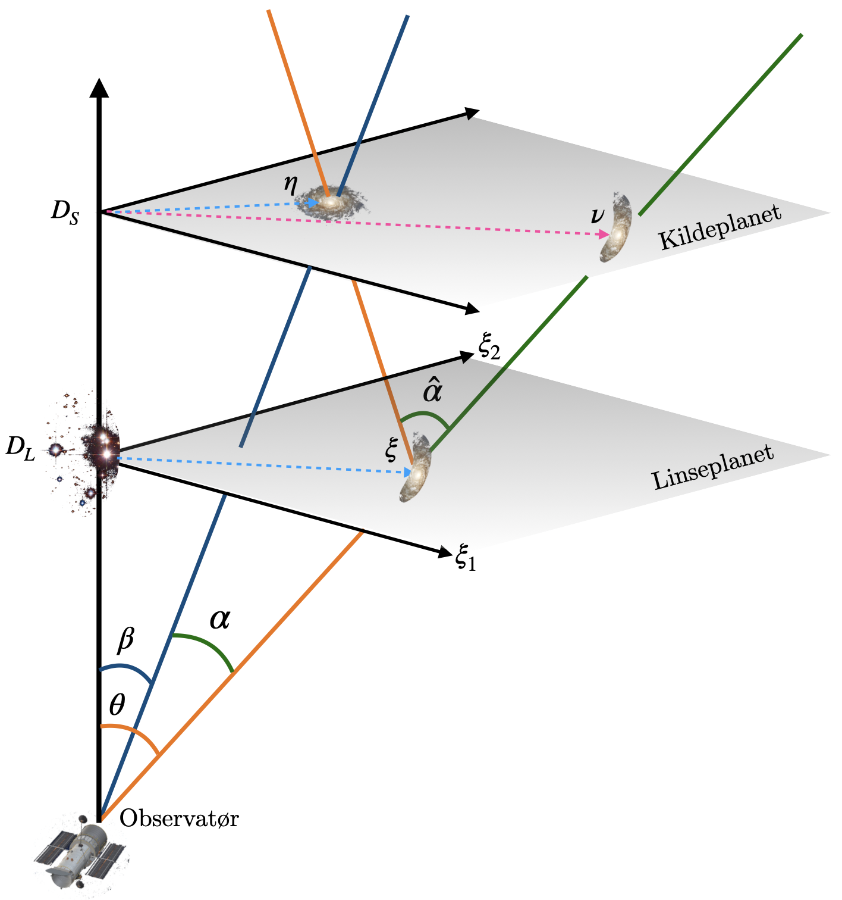

# Mathematical model

The basic problem we study is that of gravitational lensing.
Seen from Earth, the light from a distance galaxy (called the
*source*) may be deflected by the gravitation of huge bodies of 
mass (called the *lens*) located between the source and the observer.

The deflective power of the lens is determined by a function
$\psi(\xi)$ called the *lens potential*, where $\xi$ is a point
in the lens plane.
Different mass distributions give rise to different lens potentials.

In this chapter we will review the basic models and notation that
we use throughout the project.

